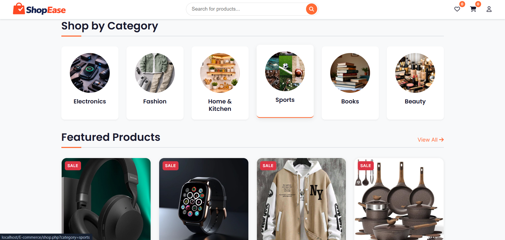
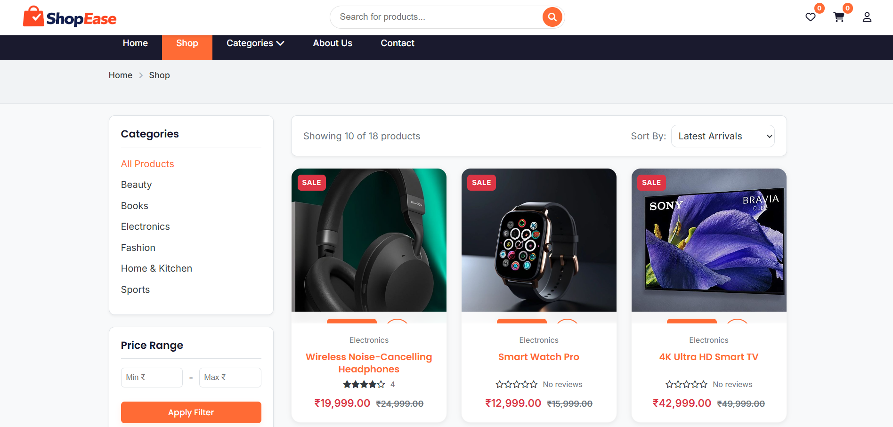
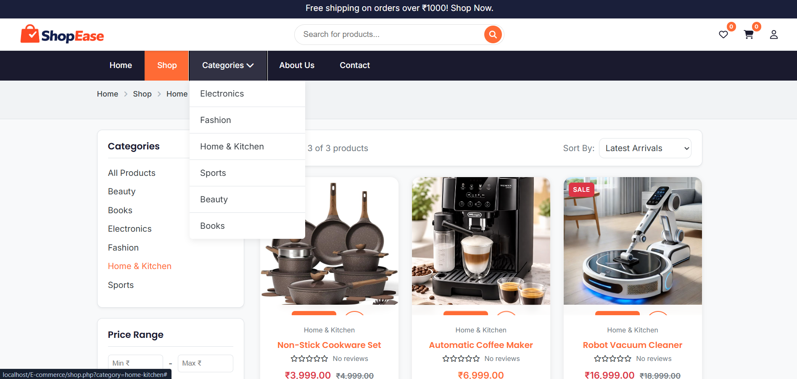
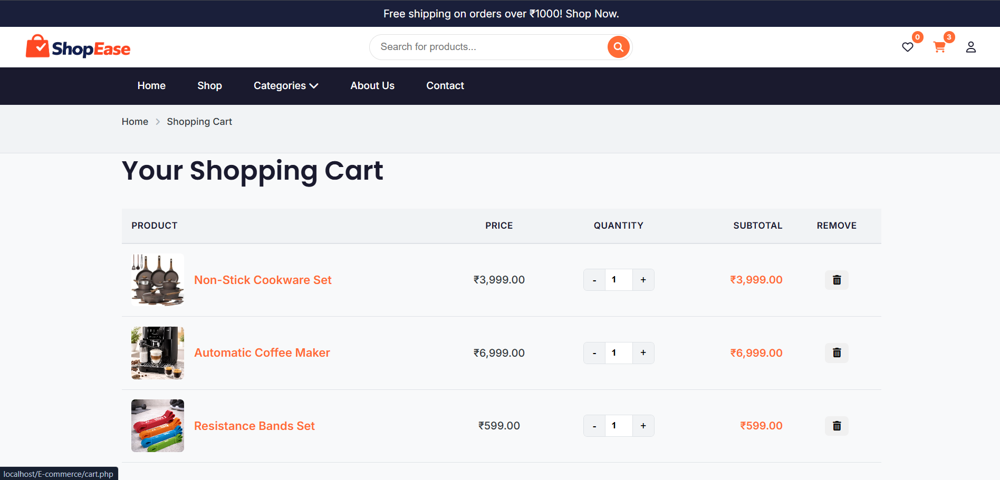
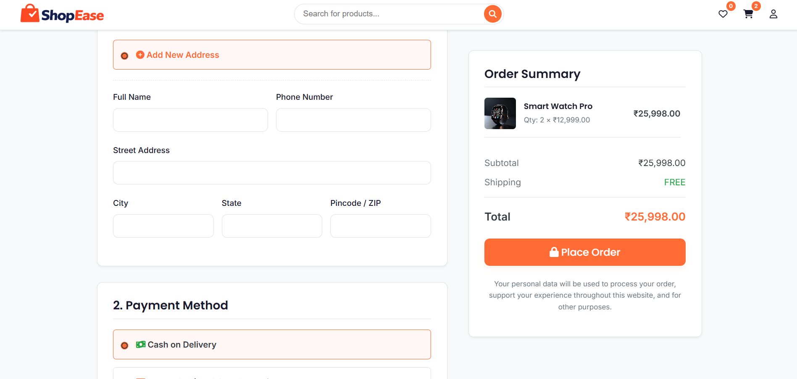
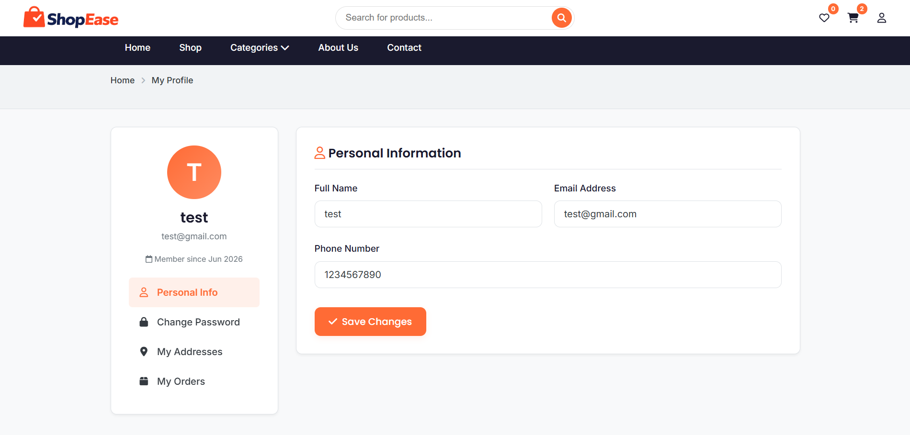
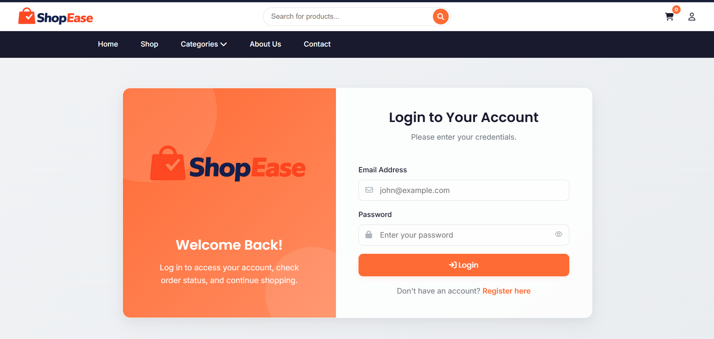
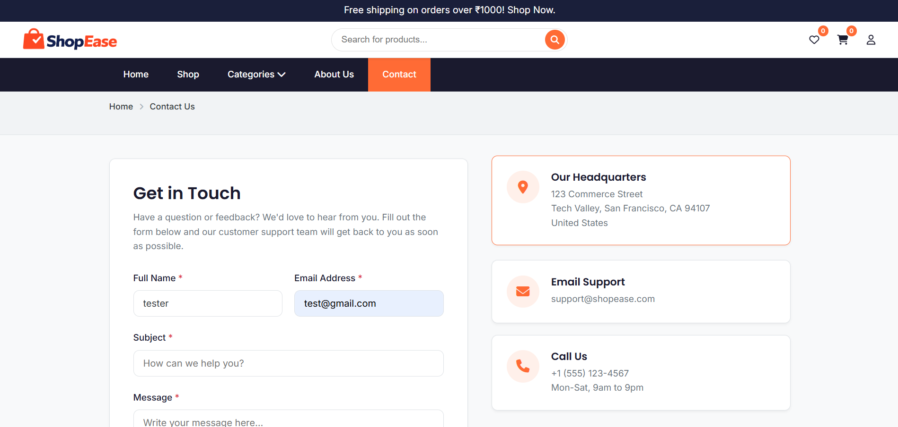

<div align="center">
  

  <h1> ShopEase</h1>
  <p><strong>Next-Generation E-commerce Experience</strong></p>

  <p>
    <a href="https://php.net"></a>
    <a href="https://mysql.com/"></a>
    <a href="https://developer.mozilla.org/en-US/docs/Web/JavaScript"></a>
  </p>
</div>

---

## About ShopEase
**ShopEase** is a robust, full-stack E-commerce web application designed to deliver a premium, seamless shopping experience. Built from the ground up without heavy front-end frameworks, it showcases the power of native web technologies combined with a highly optimized PHP backend. 

From dynamic cart management to real-time AJAX product reviews and secure authentication, ShopEase unifies catalog browsing, customer engagement, and order management into a single, high-performance platform with fluid UI animations and micro-interactions.

---

## Key Features & Ecosystem

ShopEase employs a modern architecture to deliver a seamless shopping journey:

### 1. Customer Shopping Experience
A dynamic, customer-centric hub designed for maximum engagement.
- **Dynamic Catalog:** Browse products seamlessly with advanced filtering and instant search capabilities.
- **Digital Cart & Wishlist:** Real-time cart calculations, stock verification, and a persistent wishlist to save favorite items.
- **Product Reviews:** An asynchronous, AJAX-powered star rating system where verified users can submit feedback without page reloads.
- **Profile Dashboard:** A personalized hub to manage personal information, shipping addresses, and track order history.


### 2. Beautiful & Responsive UI
- **Custom Toast Notifications:** Replacing native browser tooltips with sleek, sliding toast dialogs for form validation, cart additions, and flash messages.
- **Interactive Modals:** Beautifully animated dialog boxes for critical actions (e.g., secure logout confirmation).
- **Responsive Design:** 100% fluid layouts utilizing CSS Grid and Flexbox, guaranteeing a flawless experience on desktops, tablets, and mobile devices.

---

## Visual Showcase

Take a look at the platform in action:

| Home & Discovery | Shopping Experience |
|:---:|:---:|
|  <br> *Dynamic Hero Banner & Categories* |  <br> *Advanced Filtering & Product Grid* |
|  <br> *Rich Galleries & AJAX Reviews* |  <br> *Real-time Cart Management* |

| Checkout & Profiles | Authentication & Contact |
|:---:|:---:|
|  <br> *Seamless Order Processing* |  <br> *User Details & Order History* |
|  <br> *Secure Authentication* |  <br> *EmailJS Integrated Support* |

> **Note:** If the images above are not displaying, ensure you have placed your screenshots inside the `screenshots/` directory with the exact filenames listed.

---

## Technical Architecture & Stack

### Frontend Application
- **Markup & Styling:** HTML5 & Custom Vanilla CSS variables, bypassing heavy libraries like Tailwind or Bootstrap for pure structural control.
- **Interactivity:** Vanilla JavaScript (`main.js`) handling all DOM manipulation, custom form validation (`novalidate`), modal toggling, and asynchronous `fetch` requests.
- **Animations:** CSS Keyframes and transition curves tailored for micro-interactions (e.g., button states, modal pop-ins, sliding toast alerts).
- **Communication:** Integrated with **EmailJS** to handle client-side email dispatching directly from the contact forms without exposing backend SMTP configurations.

### Backend Infrastructure
- **Server Environment:** PHP 8+ handling robust server-side routing, session management, and API endpoints.
- **Database:** MySQL utilizing PDO (PHP Data Objects) with prepared statements to prevent SQL injection vulnerabilities.
- **Session Management:** Hardened cookie sessions ensuring persistent "Remember Me" functionality up to 30 days securely.
- **State Handling:** Custom JSON responders for AJAX endpoints, coupled with PHP Session-based flash messages for synchronous fallbacks.

---

## Security Posture
Data integrity and privacy are paramount in ShopEase:
- **Prepared Statements:** All database queries utilize strict PDO prepared statements, completely neutralizing SQL injection vectors.
- **XSS Prevention:** Comprehensive data sanitization and output escaping (`htmlspecialchars`) to thwart Cross-Site Scripting.
- **AJAX Hardening:** API endpoints verify `X-Requested-With` headers and session validity before processing JSON payloads.
- **Sanitized Configurations:** The `.gitignore` prevents `.env` and other configuration files from exposing DB credentials or EmailJS private keys.

---

## Installation & Setup Guide

### Prerequisites
- **Local Server Environment:** XAMPP, WAMP, or MAMP (PHP 8.0+ and MySQL).
- **Web Browser:** Any modern browser (Chrome, Firefox, Edge, Safari).

### Build Instructions
1. **Clone the Repository:**
   ```bash
   git clone https://github.com/yourusername/shopease.git
   ```
2. **Move to Server Root:**
   - Move the cloned `shopease` folder into your local server's public directory (e.g., `htdocs` for XAMPP or `www` for WAMP).
3. **Database Configuration:**
   - Open phpMyAdmin (`http://localhost/phpmyadmin`).
   - Create a new database named `ecommerce`.
   - Import the provided SQL schema file (located at `database/ecommerce.sql`).
4. **Environment Setup:**
   - Navigate to `config/constants.php` and verify the `DB_HOST`, `DB_USER`, `DB_PASS`, and `DB_NAME` match your local setup.
5. **Run the Application:**
   - Open your browser and navigate to: `http://localhost/shopease`

---

## Codebase Anatomy
```text
ShopEase/
├── actions/             # Backend endpoint handlers (AJAX & Form Actions)
├── assets/              # Static resources
│   ├── css/             # Custom vanilla stylesheets (style.css, responsive.css)
│   ├── images/          # UI assets and product imagery
│   └── js/              # Vanilla JavaScript modules (main.js, cart.js)
├── config/              # Database connections and global constants
├── database/            # SQL dumps and schema blueprints
├── includes/            # Reusable PHP components (Header, Footer, Functions)
├── screenshots/         # Documentation visuals
└── *.php                # Core frontend pages (index, shop, product, profile)
```

---

## Contributing
Contributions, issues, and feature requests are highly welcome! 
1. Fork the project.
2. Create your feature branch: `git checkout -b feature/EpicSuperFeature`
3. Commit your changes: `git commit -m 'Add some EpicSuperFeature'`
4. Push to the branch: `git push origin feature/EpicSuperFeature`
5. Open a Pull Request.

---

<p align="center">
  <i>Architected & Developed with ❤️ for the future of E-commerce.</i>
</p>
